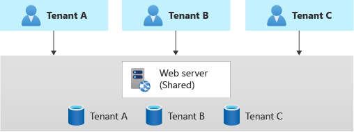
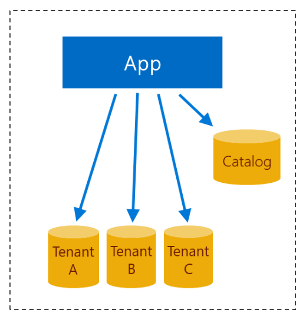
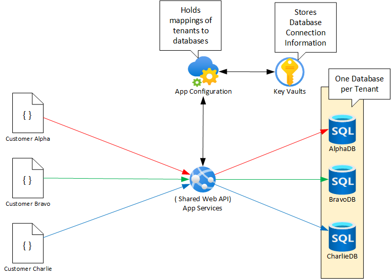

# Creating a Multi-Tenant Web API using App Configuration Service and Key Vault

To create web applications and APIs that are multi-tenant, the application/API code needs to be multitenancy aware. The applications/APIs must be able to determine the tenant the request belongs to and ensure the appropriate database is used for transactions belonging to a particular tenant. This is especially true when using the [horizontally partitioned deployment](https://docs.microsoft.com/en-us/azure/architecture/guide/multitenant/considerations/tenancy-models#horizontally-partitioned-deployments) multi-tenancy model, as shown below.



In this model, the data is isolated into database per tenant and the front-end application and APIs are shared. As such the [recommended approach](https://docs.microsoft.com/en-us/azure/azure-sql/database/saas-tenancy-app-design-patterns#d-multi-tenant-app-with-database-per-tenant) is to use a Catalog to store mappings of tenants to databases, as shown below.



The applications/APIs consult the Catalog, get the tenant specific database connection information, and complete the operations as necessary using the appropriate tenant database. 

## Proposed Architecture

To create a multi-tenant application or API, the below architecture is proposed.



### Components

1. [App Service](https://docs.microsoft.com/en-us/azure/app-service/overview): This hosts the multi-tenant application or API code.

1. [App Configuration Service](https://docs.microsoft.com/en-us/azure/azure-app-configuration/overview): This contains all tenant configurations arranged in grouping by tenant identifier. See below for Keys pattern.

1. [Key Vault](https://docs.microsoft.com/en-us/azure/key-vault/general/overview): This stores all sensitive tenant information such as database connection information and other credentials.

### App Configuration Keys Pattern

Use Key prefixes to create groupings of configurations corresponding to each tenant. Name the settings in the format "\<TenantName\>:\<Grouping\>:\<Key-Name\>".

For example, given the tenants "Alpha, Bravo, Charlie", you can set up the "CustomerName" setting as below:

```bash
"Alpha:Settings:CustomerName"

"Bravo:Settings:CustomerName"

"Charlie:Settings:CustomerName"

```

And to setup the "OrderDBConnection" connection string:

```bash
"Alpha:ConnectionStrings:OrderDBConnection"

"Bravo:ConnectionStrings:OrderDBConnection"

"Charlie:ConnectionStrings:OrderDBConnection"
```

## Setup Demo

Following are the high-level steps for setting up the demo application:

1. Create the services, Azure App Service, Azure App Configuration Service, and Azure Key Vault service.
1. Configure the Services.
1. Test the API by sending requests simulating multiple tenants.

### Setup Azure Services

1. Create a resource group

    ```bash
    az login # Login via browser
    az group create -n "<Your Resource Group Name>" -l "<Your Resource Location>"
    ```

1. Setup the Azure App Service (this may take a few minutes)

    ```bash
    az deployment group create --resource-group "<Your Resource Group Name>" --template-file deploy/AppService.bicep
    ```

1. Setup Azure App Configuration Service (this may take a few minutes)

    ```bash
    az deployment group create --resource-group "<Your Resource Group Name>" --template-file deploy/AppConfigurationService.bicep
    ```

1. Setup Azure Key Vault

    ```bash
    az deployment group create --resource-group "<Your Resource Group Name>" --template-file deploy/KeyVault.bicep
    ```

1. Configure the Azure Services, set up Key Vault secrets, access policies, etc.

    ```bash
    az deployment group create --resource-group "<Your Resource Group Name>" --template-file deploy/ConfigureServices.bicep
    ```

1. Test the deployed API by sending requests simulating different tenants.

    1. Alpha tenant request, replace the \<Your-Site-Name\> with the name of your web site.

    ```bash
    curl -X POST https://<Your-Site-Name>.azurewebsites.net/api/Configs/Customer/Order -H 'Content-Type: application/json' -d '{ "Date" : "2022-04-14", "OrderId" : 1, "TenantId" : "Alpha", "OrderDetail" : "Create Alpha Work Order" }'
    ```

    Response should be:

    ```bash
    {"status":"Submitted for customer id : 101","orderDetail":"Create Alpha Work Order","customerName":"Customer Alpha","connectionString":"Server=ABC,1433;InitialCatalog=AlphaDatabase;UsingKeyVault=true"}
    ```

    1. Bravo tenant request

    ```bash
    curl -X POST https://<Your-Site-Name>.azurewebsites.net/api/Configs/Customer/Order -H 'Content-Type: application/json' -d '{ "Date" : "2022-04-14", "OrderId" : 1, "TenantId" : "Bravo", "OrderDetail" : "Create Bravo Work Order" }'
    ```

    Response should be:

    ```bash
    {"status":"Submitted for customer id : 102","orderDetail":"Create Bravo Work Order","customerName":"Customer Bravo","connectionString":"Server=ABC,1433;InitialCatalog=BravoDatabase;UsingKeyVault=true"}
    ```
